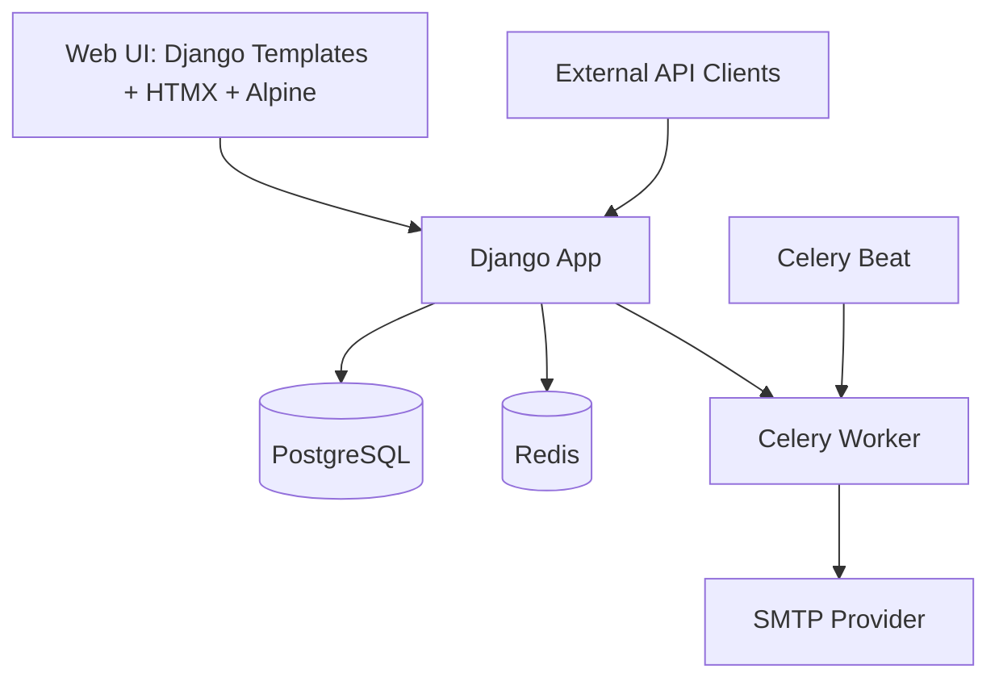
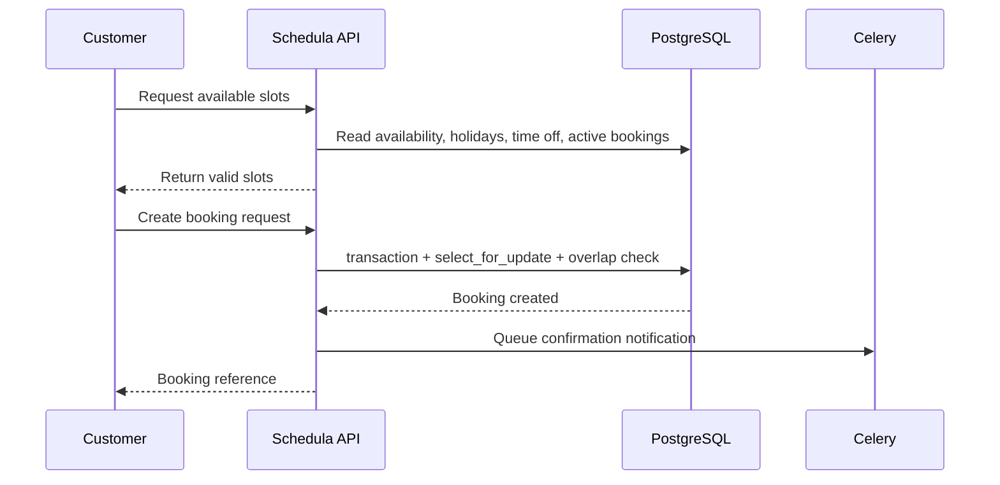
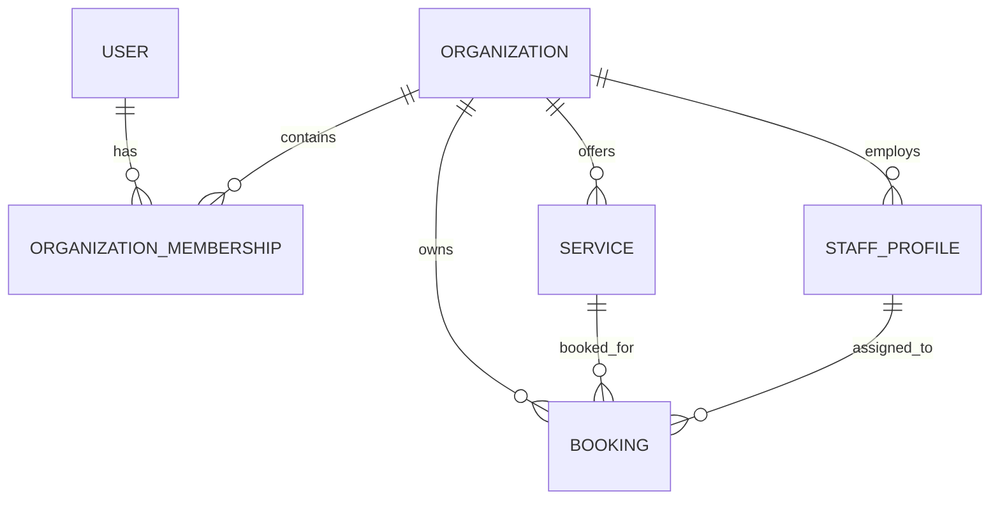
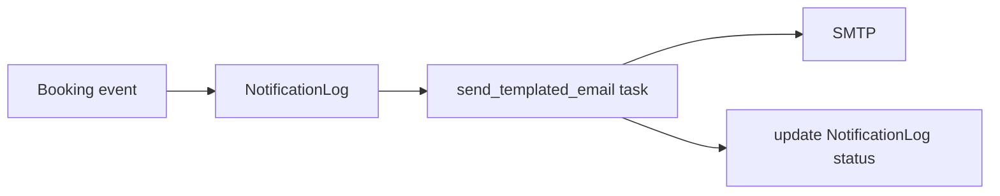

# Architecture

## High-level architecture

```mermaid
graph TD
  Browser[Web UI: Django Templates + HTMX + Alpine] --> Django[Django App]
  Mobile[External API Clients] --> Django
  Django --> Postgres[(PostgreSQL)]
  Django --> Redis[(Redis)]
  Django --> Celery[Celery Worker]
  Celery --> SMTP[SMTP Provider]
  CeleryBeat[Celery Beat] --> Celery
```

## Booking flow

```mermaid
sequenceDiagram
  participant C as Customer
  participant API as Schedula API
  participant DB as PostgreSQL
  C->>API: Request available slots
  API->>DB: Read availability, holidays, time off, active bookings
  API-->>C: Return valid slots
  C->>API: Create booking request
  API->>DB: transaction + select_for_update + overlap check
  DB-->>API: Booking created
  API->>Celery: Queue confirmation notification
  API-->>C: Booking reference
```

## Organization and user relationships

```mermaid
erDiagram
  USER ||--o{ ORGANIZATION_MEMBERSHIP : has
  ORGANIZATION ||--o{ ORGANIZATION_MEMBERSHIP : contains
  ORGANIZATION ||--o{ SERVICE : offers
  ORGANIZATION ||--o{ STAFF_PROFILE : employs
  ORGANIZATION ||--o{ BOOKING : owns
  SERVICE ||--o{ BOOKING : booked_for
  STAFF_PROFILE ||--o{ BOOKING : assigned_to
```

## Notification flow

```mermaid
graph LR
  BookingEvent[Booking event] --> NotificationLog
  NotificationLog --> CeleryTask[send_templated_email task]
  CeleryTask --> SMTP
  CeleryTask --> StatusUpdate[update NotificationLog status]
```
